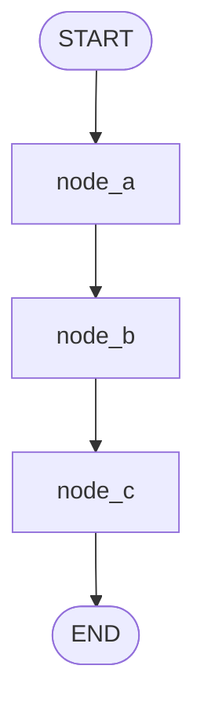
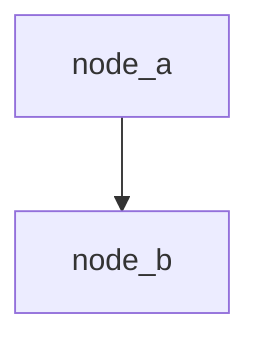

# 에이전트 개발 규칙

## 목적

- 에이전트를 추가하거나 수정할 때 일관된 구조, 로깅, 문서화 기준을 적용한다.
- 이 문서는 작업 에이전트가 판단 기준으로 사용하는 규칙서다. 모든 항목은 조건과 규칙으로 명시한다.

## 적용 범위

- 신규 에이전트 추가 및 기존 에이전트 수정 작업 전반
- 에이전트 관련 로깅, 다이어그램, README, `AGENTS.md` 유지 작업

---

## 1. 에이전트 유형 판별

| 조건 | 유형 |
|---|---|
| `package.xml` 존재 | ROS 패키지형 |
| `package.xml` 없음 | Python 패키지형 |

현재 프로젝트의 에이전트 유형:

| 에이전트 | 유형 |
|---|---|
| `rosa` | Python 패키지형 |
| `turtle-agent` | ROS 패키지형 |

---

## 2. 표준 디렉토리 구조


### ROS 패키지형

소스 코드는 반드시 `src/<agent_name>/scripts/` 아래에 위치한다.

```plaintext
src/
  <agent_name>/
    CMakeLists.txt
    package.xml
    launch/
      <agent_name>.launch
    scripts/
      __init__.py
      <agent_name>.py     # 에이전트 메인 실행 파일
      prompts.py
      llm.py
      logger.py           # 에이전트 전용 로거
      tools/
        __init__.py
        <tool_name>.py
    README.md
.vscode/
  launch.json
config/
  logging/
    <agent_name>.yaml
```

### Python 패키지형

소스 코드는 `src/<agent_name>/` 바로 아래에 위치한다.

```plaintext
src/
  <agent_name>/
    __init__.py
    <agent_name>.py     # 에이전트 메인 실행 파일
    prompts.py
    logger.py           # 에이전트 전용 로거
    tools/
      __init__.py
      <tool_name>.py
    README.md
.vscode/
  launch.json
config/
  logging/
    <agent_name>.yaml
```

### 공통

```plaintext
docs/
  *.md
AGENTS.md
README.md
```

---

## 3. 실행 진입점


| 유형 | 실행 명령어 |
|---|---|
| ROS 패키지형 | `roslaunch <agent_name> <agent_name>.launch` |
| Python 패키지형 | `uv run python src/<agent_name>/<agent_name>.py` |

모듈 단독 실행이 필요한 경우 해당 파일에 `if __name__ == "__main__":` 진입점을 작성한다.

---

## 4. 로깅 규칙

### 4.1 기본 원칙

- 로깅 라이브러리는 `loguru`를 사용한다.
- 설정은 코드가 아니라 `config/logging/<agent_name>.yaml`에서 관리한다.
- `logger.py`는 다음 2개 함수만 외부에 제공한다.
  - `configure_logger(level: str | None = None)`: 프로세스 시작 시 1회 초기화
  - `get_logger(module: str)`: 모듈 컨텍스트를 바인딩한 로거 반환
- `logger.remove()` 후 sink 1개만 등록하여 중복 출력을 방지한다.

### 4.2 로그 레벨 기준

| 레벨 | 사용 기준 |
|---|---|
| `DEBUG` | 내부 처리 단계, skip 분기 |
| `INFO` | 시작/완료, 집계 개수 |
| `WARNING` | 입력 누락, 설정 파일 누락, 지원 불가 스키마 |
| `ERROR` / `EXCEPTION` | 예외 발생 시 |

### 4.3 의존성

`pyproject.toml`에 `loguru`, `pyyaml`이 포함되어야 한다.

### 4.4 logger.py 위치 및 PROJECT_ROOT 설정

> **[신규]** `logger.py` 위치와 `_PROJECT_ROOT` 계산은 에이전트 유형에 따라 다르다.

| 유형 | logger.py 위치 | `_PROJECT_ROOT` |
|---|---|---|
| ROS 패키지형 | `src/<agent_name>/scripts/logger.py` | `Path(__file__).resolve().parents[3]` |
| Python 패키지형 | `src/<agent_name>/logger.py` | `Path(__file__).resolve().parents[2]` |

### 4.5 logger.py 템플릿

```python
from __future__ import annotations

import os
import sys
from pathlib import Path
from typing import Any

import yaml
from loguru import logger

_LOGGER_CONFIGURED = False
# 유형별 parents 깊이: ROS 패키지형 → parents[3], Python 패키지형 → parents[2]
_PROJECT_ROOT = Path(__file__).resolve().parents[3]
_DEFAULT_CONFIG_PATH = _PROJECT_ROOT / "config/logging/<agent_name>.yaml"
_DEFAULT_LOGGER_CONFIG: dict[str, Any] = {
    "level": "INFO",
    "backtrace": False,
    "diagnose": False,
    "sink": "stderr",
    "format": "{time:YYYY-MM-DD HH:mm:ss.SSS} | {level: <8} | {extra[module]}:{function}:{line} | {message}",
}


def _load_logger_config() -> tuple[dict[str, Any], str]:
    config_path = Path(
        os.getenv("<AGENT_ENV_LOG_CONFIG>", str(_DEFAULT_CONFIG_PATH))
    ).expanduser()
    if not config_path.is_absolute():
        config_path = (_PROJECT_ROOT / config_path).resolve()

    if not config_path.exists():
        return dict(_DEFAULT_LOGGER_CONFIG), f"logging config not found: {config_path}"

    try:
        loaded = yaml.safe_load(config_path.read_text(encoding="utf-8")) or {}
        if not isinstance(loaded, dict):
            raise TypeError("logging config must be a mapping")
    except Exception as exc:
        return dict(_DEFAULT_LOGGER_CONFIG), f"failed to load logging config: {exc}"

    config = dict(_DEFAULT_LOGGER_CONFIG)
    config.update(loaded)
    return config, ""


def configure_logger(level: str | None = None) -> None:
    global _LOGGER_CONFIGURED
    if _LOGGER_CONFIGURED:
        return

    config, warning_message = _load_logger_config()
    if level:
        config["level"] = level

    sink_name = str(config.get("sink", "stderr")).lower()
    sink = sys.stdout if sink_name == "stdout" else sys.stderr

    logger.remove()
    logger.add(
        sink,
        level=str(config["level"]),
        backtrace=bool(config["backtrace"]),
        diagnose=bool(config["diagnose"]),
        format=str(config["format"]),
    )
    _LOGGER_CONFIGURED = True
    if warning_message:
        logger.bind(agent="<agent_name>", module="logger").warning(warning_message)


def get_logger(module: str):
    configure_logger()
    return logger.bind(agent="<agent_name>", module=module)
```

### 4.6 모듈에서 logger import

| 유형 | import 구문 |
|---|---|
| Python 패키지형 | `from <agent_name>.logger import get_logger` |
| ROS 패키지형 | `from logger import get_logger` |

```python
from logger import get_logger  # ROS 패키지형 예시

logger = get_logger("tools.example_tool")

def example_node(state: dict) -> dict:
    logger.info("example_node 시작")
    try:
        logger.info("example_node 완료")
        return {"status": "ok"}
    except Exception:
        logger.exception("example_node 실행 실패")
        raise
```

### 4.7 YAML 템플릿

```yaml
level: INFO
backtrace: false
diagnose: false
sink: stderr
format: "<green>{time:YYYY-MM-DD HH:mm:ss.SSS}</green> | <level>{level: <8}</level> | <cyan>{extra[module]}</cyan>:<cyan>{function}</cyan>:<cyan>{line}</cyan> | <level>{message}</level>"
```

### 4.8 운영 변경 방법

- 로그 포맷/레벨 변경은 `config/logging/<agent_name>.yaml`만 수정한다.
- 변경 반영을 위해 프로세스를 재시작한다. (시작 시 1회 로드 정책)
- 임시 경로 전환이 필요하면 환경변수로 설정 파일 경로를 변경한다.

---

## 5. Mermaid 다이어그램 작성 기준

에이전트 내 함수(노드) 흐름이 2개 이상일 때만 작성한다. 단일 함수 에이전트는 생략한다.

### 5.1 기본 원칙

- 방향은 `flowchart TB`를 사용한다.
- 노드는 함수명으로 표기한다.
- 예외 처리 경로와 비공개 함수는 제외한다.
- 시작과 종료는 `START` / `END` 노드로 명시한다.
- 간선 라벨은 변수명이 아닌 처리 의미 중심으로 작성한다.
  - 금지 예: `repository_url`, `py_files`
  - 권장 예: `분석 대상 저장소 주소`, `핵심 호출 지표`

### 5.2 표준 템플릿



---

## 6. README 작성 기준

### 6.1 공통 원칙

- 문서는 한국어로 작성한다.
- 첫 문단에서 "무엇을 하는 컴포넌트인지"를 1~2문장으로 설명한다.
- 실행 명령어는 모두 코드 블록(`bash`)으로 제공한다.
- 경로/모듈/심볼은 백틱(`` ` ``)으로 표기한다.
- 그래프 흐름이 핵심이면 `mermaid`를 포함한다.

### 6.2 프로젝트 루트 README 섹션 순서

1. 프로젝트 개요
2. 주요 기능
3. 프로젝트 구조
4. 실행 방법
5. 개발 환경 및 설치
6. 환경 변수 예시

### 6.3 에이전트 README 섹션 순서

1. 에이전트 개요 (입력/처리/출력 요약)
2. 노드 구성
3. 그래프 시각화 (`mermaid`, 선택)
4. 상태 스키마
5. 실행 방법

### 6.4 에이전트 README 템플릿

````md
# <agent_name>

`<agent_name>`는 <역할 설명> 에이전트입니다.

## 목적
- 입력: ...
- 처리: ...
- 출력: ...

## 노드 구성
1. `node_a`
2. `node_b`

## 그래프 시각화


## 상태 스키마
- `field_a: type` - 설명
- `field_b: type` - 설명

## 실행 방법
```bash
roslaunch <agent_name> <agent_name>.launch
# 또는
uv run python src/<agent_name>/<agent_name>.py <args>
```
````

---

## 7. AGENTS.md 유지 기준

`AGENTS.md`는 참고 md 파일의 위치를 기록하는 인덱스다. 운영 규칙 본문은 포함하지 않는다.

### 7.1 핵심 원칙

- 참고 md 파일 경로를 링크로 나열하고, 각 파일의 목적을 1~2줄로 요약한다.
- 운영 규칙 본문은 각 참고 md에 둔다.

### 7.2 업데이트 트리거

- 참고 md 경로/파일명 변경, 신규 추가, 삭제

### 7.3 업데이트 절차

1. 변경된 경로 확인
2. 링크와 요약 수정
3. 링크 유효성 검증

### 7.4 금지 사항

- 운영 규칙 본문을 복제하는 행위
- 참고 md와 상충하는 지침 추가

---

## 8. 완료 체크리스트

### 8.1 신규 에이전트 추가

- [ ] `src/<agent_name>/`에 `package.xml`이 있는지 확인하여 에이전트 유형을 판별했는가?
- [ ] 판별된 유형의 표준 디렉토리 구조를 따르고 있는가?
- [ ] Section 3의 실행 진입점 규칙에 맞는 명령어로 실행되는가?
- [ ] `logger.py`의 `_PROJECT_ROOT`를 유형별 올바른 `parents` 깊이로 설정했는가?
- [ ] `config/logging/<agent_name>.yaml`을 작성했는가?
- [ ] 소스 파일에서 `get_logger(...)`를 사용하는가?
- [ ] 주요 실행/디버깅 엔트리가 `.vscode/launch.json`에 등록됐는가?
- [ ] 에이전트 `README.md`를 작성했는가?
- [ ] 함수 흐름이 2개 이상이면 Mermaid 다이어그램을 포함했는가?

### 8.2 로거 검증

- [ ] `configure_logger()`가 1회 초기화로 동작하는가?
- [ ] 설정 파일 누락 시 경고 + 기본값 폴백이 동작하는가?
- [ ] 로그에 `module:function:line`이 출력되는가?
- [ ] YAML 수정만으로 로그 형식/레벨이 바뀌는가?

### 8.3 다이어그램 검증 (작성한 경우)

- [ ] `flowchart TB`를 사용했는가?
- [ ] 노드가 함수명으로 표기되었는가?
- [ ] 비공개 함수가 제외되었는가?
- [ ] 간선 라벨이 변수명이 아닌 의미 중심인가?

### 8.4 문서 정합성

- [ ] README의 실행 명령어가 실제로 동작하는가?
- [ ] 경로/모듈명이 현재 코드와 일치하는가?
- [ ] `AGENTS.md`에 기록된 참고 md 링크가 유효한가?
